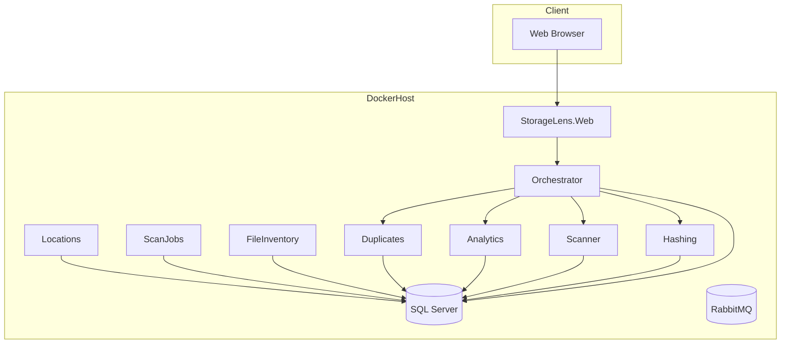

# Deployment Architecture

```mermaid
flowchart TB
    subgraph Client
        Browser[Web Browser]
    end

    subgraph DockerHost
        Web[StorageLens.Web]
        Loc[Locations]
        Jobs[ScanJobs]
        FI[FileInventory]
        Dup[Duplicates]
        Ana[Analytics]
        Scn[Scanner]
        Hsh[Hashing]
        Orch[Orchestrator]
        Sql[(SQL Server)]
        Rmq[(RabbitMQ)]
    end

    Browser --> Web
    Web --> Orch
    Orch --> Scn
    Orch --> Hsh
    Orch --> Dup
    Orch --> Ana
    Loc --> Sql
    Jobs --> Sql
    FI --> Sql
    Dup --> Sql
    Ana --> Sql
    Scn --> Sql
    Hsh --> Sql
    Orch --> Sql
```
