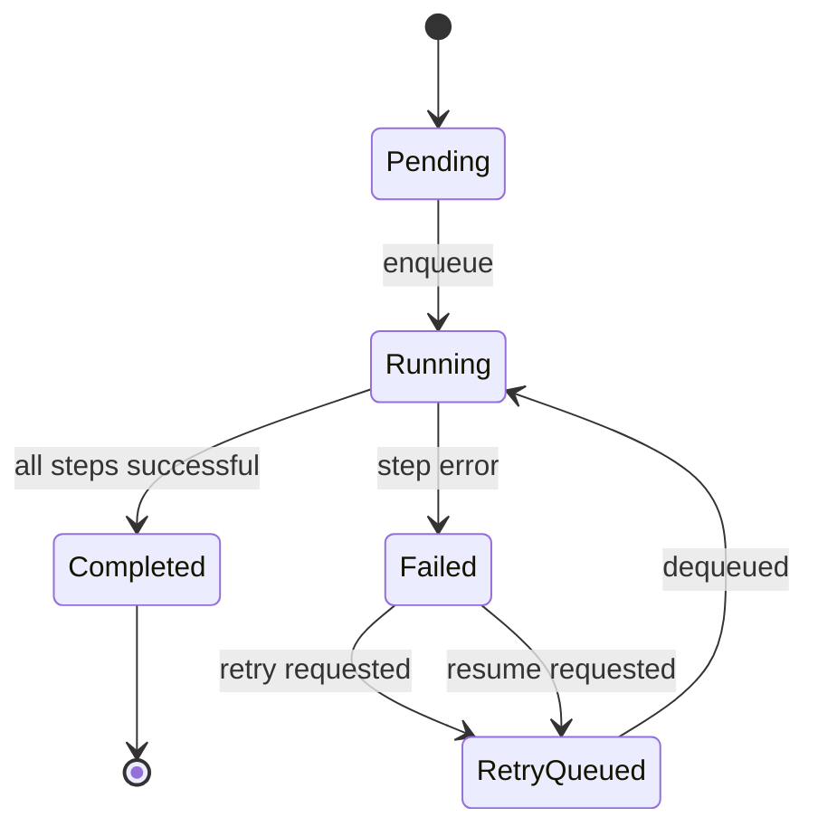

# Retry and Resume Workflow

```mermaid
stateDiagram-v2
    [*] --> Pending
    Pending --> Running: enqueue
    Running --> Completed: all steps successful
    Running --> Failed: step error
    Failed --> RetryQueued: retry requested
    RetryQueued --> Running: dequeued
    Failed --> RetryQueued: resume requested
    Completed --> [*]
```
