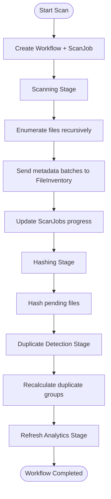

# Scan Workflow

```mermaid
flowchart TD
    Start([Start Scan]) --> CreateWorkflow[Create Workflow + ScanJob]
    CreateWorkflow --> Stage1[Scanning Stage]
    Stage1 --> Enumerate[Enumerate files recursively]
    Enumerate --> Batch[Send metadata batches to FileInventory]
    Batch --> Progress[Update ScanJobs progress]
    Progress --> Stage2[Hashing Stage]
    Stage2 --> HashPending[Hash pending files]
    HashPending --> Stage3[Duplicate Detection Stage]
    Stage3 --> Recalc[Recalculate duplicate groups]
    Recalc --> Stage4[Refresh Analytics Stage]
    Stage4 --> Complete([Workflow Completed])
```
