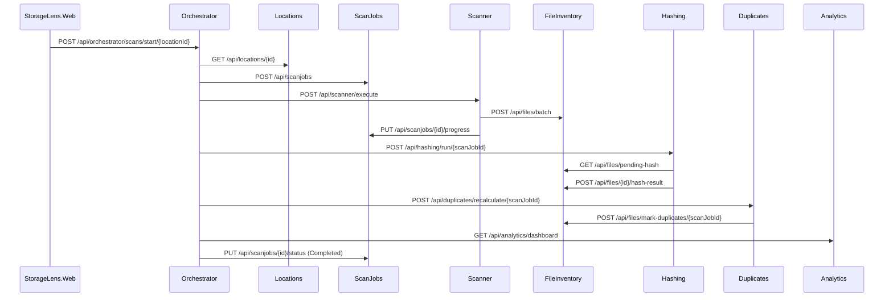

# Service Interactions

```mermaid
sequenceDiagram
    participant U as StorageLens.Web
    participant O as Orchestrator
    participant L as Locations
    participant J as ScanJobs
    participant S as Scanner
    participant F as FileInventory
    participant H as Hashing
    participant D as Duplicates
    participant A as Analytics

    U->>O: POST /api/orchestrator/scans/start/{locationId}
    O->>L: GET /api/locations/{id}
    O->>J: POST /api/scanjobs
    O->>S: POST /api/scanner/execute
    S->>F: POST /api/files/batch
    S->>J: PUT /api/scanjobs/{id}/progress
    O->>H: POST /api/hashing/run/{scanJobId}
    H->>F: GET /api/files/pending-hash
    H->>F: POST /api/files/{id}/hash-result
    O->>D: POST /api/duplicates/recalculate/{scanJobId}
    D->>F: POST /api/files/mark-duplicates/{scanJobId}
    O->>A: GET /api/analytics/dashboard
    O->>J: PUT /api/scanjobs/{id}/status (Completed)
```
