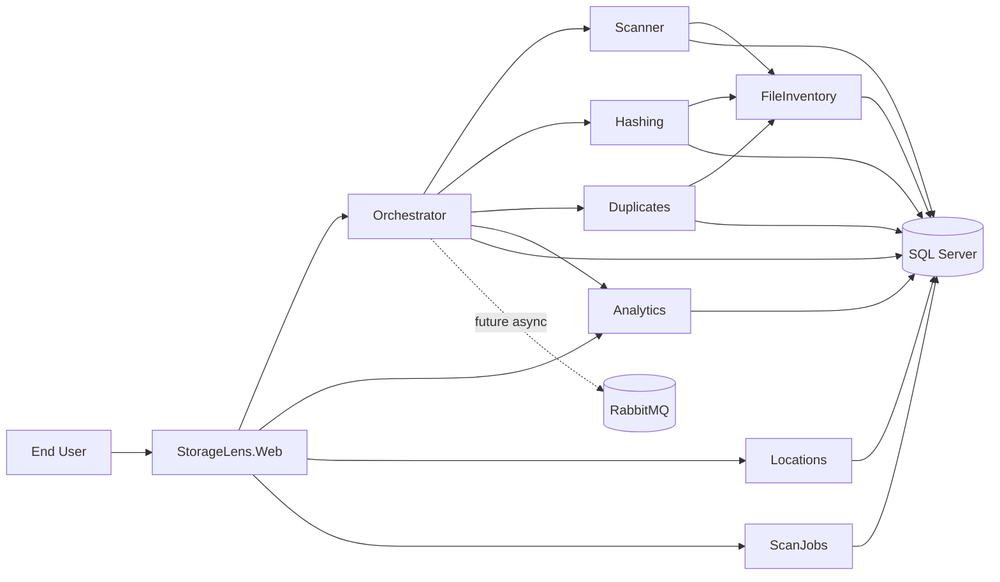

# System Architecture Diagram

```mermaid
flowchart LR
    User[End User] --> Web[StorageLens.Web]
    Web --> Orch[Orchestrator]
    Web --> Analytics[Analytics]
    Web --> Locations[Locations]
    Web --> ScanJobs[ScanJobs]

    Orch --> Scanner[Scanner]
    Orch --> Hashing[Hashing]
    Orch --> Duplicates[Duplicates]
    Orch --> Analytics

    Scanner --> FileInventory[FileInventory]
    Hashing --> FileInventory
    Duplicates --> FileInventory

    Locations --> SQL[(SQL Server)]
    ScanJobs --> SQL
    FileInventory --> SQL
    Duplicates --> SQL
    Analytics --> SQL
    Scanner --> SQL
    Hashing --> SQL
    Orch --> SQL

    Orch -. future async .-> Rabbit[(RabbitMQ)]
```
